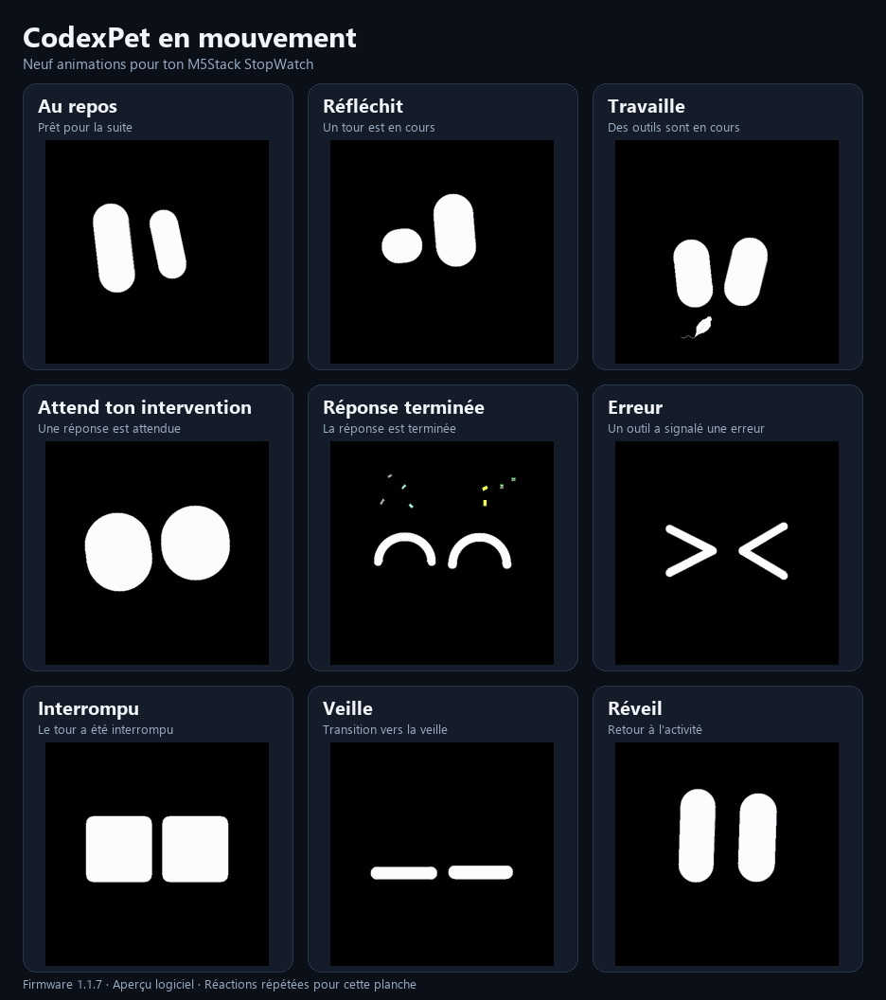
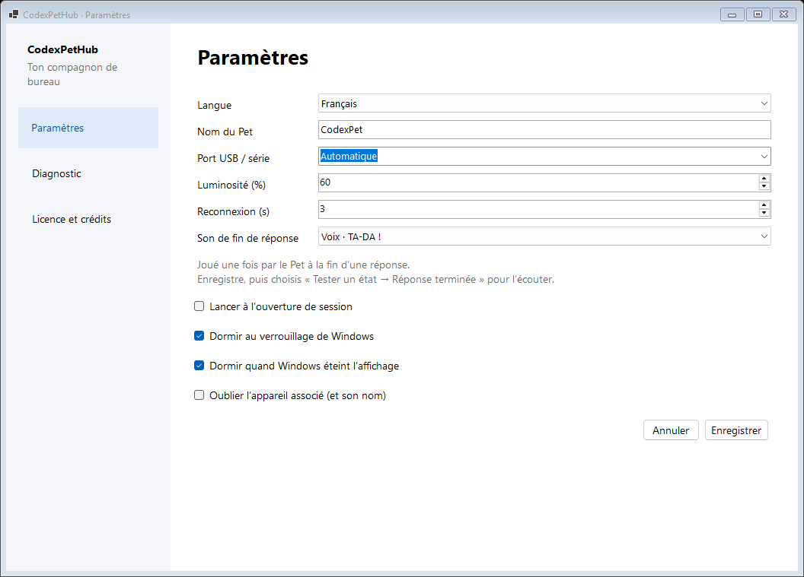

# CodexPet

[English](README.md) | [Français](README.fr.md)

Un compagnon animé sur **M5Stack StopWatch** qui affiche l'activité de Codex.
Projet maintenu par **RunDeleteParadox**, pour Windows et un Pet connecté en USB.

Le firmware dérive de **KK / M5Stack StopWatch Avatar**, créé par **trentct et ses
contributeurs** : [projet d'origine](https://github.com/Trentct/m5stack-stopwatch-avatar).
Sa licence, ses crédits et son historique Git sont conservés.

## Animations

Repère quand Codex réfléchit, utilise des outils, attend ton intervention ou
termine une réponse, et découvre les transitions de veille et de réveil du Pet.



Aperçu logiciel rendu à partir du firmware actuel. Les réactions courtes sont
répétées pour cette planche. [Voir la version fixe](docs/assets/codexpet-animations-fr.png).

## Piloter ton Pet avec CodexPetHub

Le Hub reste dans la zone de notification de Windows. Double-clique sur son icône
pour ouvrir une fenêtre regroupant **Paramètres**, **Diagnostic** et **Licence et crédits**.

| Fonction | Ce que tu peux régler |
| --- | --- |
| **Luminosité** | Ajuste l'écran de 0 à 100 % dans les Paramètres, ou utilise un préréglage depuis le menu de la systray. |
| **Français et anglais** | Change la langue de l'interface sans redémarrer. Ton choix est enregistré avec les autres préférences. |
| **Veille liée à Windows** | Mets le Pet en veille quand Windows se verrouille ou éteint l'affichage. Il reprend l'activité courante lorsque les conditions de veille sont levées. |
| **Préférences mémorisées** | Nomme ton Pet et retrouve sa luminosité, son choix audio, ses réglages USB et ses options de veille après un redémarrage. |
| **Sons de fin de réponse** | Choisis la voix TA-DA!, une fanfare de deux notes ou le silence. Le son demande le firmware 1.1.7 ou une version ultérieure. |
| **Commandes dans la systray** | Teste les animations, mets le Pet en veille, réveille-le ou reconnecte-le. Tu peux aussi lancer le Hub à l'ouverture de session Windows. |
| **Diagnostic** | Vérifie les connexions du Pet et du plugin, consulte l'activité courante et exporte un rapport de diagnostic. |



## Commencer

Le [guide utilisateur complet](docs/USER-GUIDE.fr.md) explique les prérequis,
l'installation du firmware, du Hub et du plugin, puis l'utilisation, le dépannage,
les mises à jour et la désinstallation. [English user guide](docs/USER-GUIDE.md).

| Composant | Rôle |
| --- | --- |
| [CodexPetHub](CodexPetHub/README.fr.md) | Interface Windows en français et anglais, réglages et liaison USB |
| [CodexPetPlugin](CodexPetPlugin/README.fr.md) | Hooks Codex et états transmis au Hub par un canal local |
| [CodexPetFirmware](CodexPetFirmware/README.fr.md) | Firmware ESP32-S3, animations, veille et sons |

```text
Codex → Plugin → Named Pipe local → Hub → USB / série → Pet
```

Un seul dépôt contient les trois composants ; aucun sous-module n'est nécessaire.
Seul le Hub ouvre le port série. Les prompts et transcriptions ne vont pas au Pet.

## Compiler le Hub

Avec le SDK .NET 10, depuis la racine du dépôt :

```powershell
powershell.exe -NoProfile -ExecutionPolicy Bypass -File CodexPetHub/scripts/Build.ps1 -Publish
.\CodexPetHub\artifacts\publish\CodexPetHub.exe
```

Double-clique sur l'icône de la systray pour ouvrir les Paramètres. La navigation
à gauche donne accès au Diagnostic et à la Licence et aux crédits. Les préférences
restent dans le profil utilisateur, en dehors du dépôt.

## Documentation et contribution

- [Index bilingue](docs/README.md)
- [Contribution et vérifications](CONTRIBUTING.md)
- [Crédits](CREDITS.md)
- [Licence et distribution](CodexPetHub/docs/LICENSING.md)

La documentation utilisateur est maintenue en français et en anglais. Les notes
de travail personnelles sont conservées localement dans `.local/notes`, ignoré par Git.

## Licence

Les trois composants utilisent **AGPL-3.0-or-later**. Voir [LICENSE](LICENSE),
[NOTICE](NOTICE) et les notices de chaque composant. Les dépendances conservent
leurs propres licences. Toute distribution binaire doit proposer les sources
correspondantes et les notices applicables.

Projet communautaire, sans affiliation ni approbation d'OpenAI ou de M5Stack.
